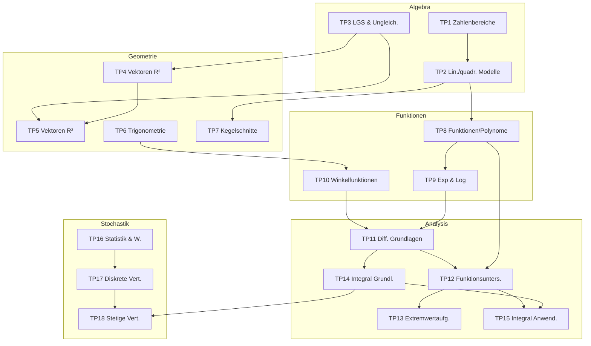

# Zusammenhangskarte

> [!info] Wozu?
> Die mündliche Matura prüft **Transfer** — also Zusammenhänge *zwischen* Themenpools. Diese Karte zeigt die wichtigsten roten Fäden. Pfeile bedeuten „baut auf / führt zu". Zentrale Bausteine sind die [[00 Start - Maturastoff Mathematik 2026#Konzeptnoten|Konzeptnoten]].

## Überblicksgraph

## Die wichtigsten roten Fäden

- **Gleichungen → Funktionen → Analysis:** Lösungen von Gleichungen ([[TP01 Zahlenbereiche & Mengen]], [[TP02 Lineare & quadratische Modelle]]) sind Nullstellen von [[TP08 Funktionen & Polynomfunktionen|Funktionen]], deren Verhalten die [[TP12 Funktionsuntersuchungen|Differentialrechnung]] präzise beschreibt.
- **Differenzieren ↔ Integrieren:** Gegenoperationen, verbunden durch den [[Hauptsatz der Differential- und Integralrechnung]]. [[TP11 Grundlagen Differentialrechnung]] → [[TP14 Grundlagen Integralrechnung]].
- **Vektoren 2D → 3D:** [[TP04 Vektoren in R2]] verallgemeinert zu [[TP05 Vektoren in R3]]; neu ist das [[Kreuzprodukt]]. Schnitte führen immer auf [[TP03 Gleichungssysteme & Ungleichungen|LGS]].
- **Dreieck → Kreis → Schwingung:** [[TP06 Trigonometrie]] (Seitenverhältnisse) → [[Einheitskreis]] → [[TP10 Winkelfunktionen]] (periodische Funktionen).
- **Wachstum:** [[TP09 Exponential- & Logarithmusfunktion]] liefert das Modell, die [[TP11 Grundlagen Differentialrechnung|Ableitung]] die Eigenschaft $N'=\lambda N$.
- **Statistik → Verteilungen:** [[TP16 Statistik & Wahrscheinlichkeit]] → diskrete [[TP17 Diskrete Verteilungen|Binomialverteilung]] → stetige [[TP18 Stetige Verteilungen|Normalverteilung]] (mit [[TP14 Grundlagen Integralrechnung|Integral]] als Fläche).

## Konzepte als Knotenpunkte
Diese atomaren Noten werden von **mehreren** Themenpools gebraucht — ideale Wiederholungsanker:

- [[Mitternachtsformel]] → TP1, TP2, TP7
- [[Skalarprodukt]] → TP4, TP5, TP6
- [[Ableitungsregeln]] → TP11, TP12, TP13, TP15
- [[Hauptsatz der Differential- und Integralrechnung]] → TP14, TP15
- [[Erwartungswert & Varianz]] → TP17, TP18, (TP16)
- [[Binomialverteilung]] → TP17, TP18

Zurück zur [[00 Start - Maturastoff Mathematik 2026|Übersicht]].
